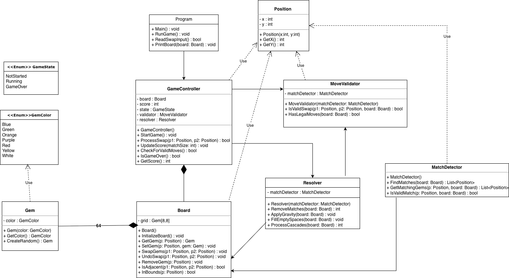

# Bejeweled

## Repository
- Public GitHub link: `https://github.com/jb0289/Bejeweled.git`

## Build and Run
- Build: `dotnet build Bejeweled.sln`
- Run: `dotnet run --project Bejeweled/Bejeweled.csproj`

## What's Implemented
- `Board`
- `Gem`
- `GemColor`
- `Position`
- `GameState`
- `MatchDetector`
- `Resolver`
- `Program`

## Not Implemented Yet
- `GameController`
- `MoveValidator` (per assignment instructions)

## Algorithm Proposals
### Match Detection
My initial idea was to check each gem's neighbors in all directions to find 3 or more of the same color in a row. I was not sure how to implement the scan cleanly.

After researching, I used a `ScanLine(dx, dy)` helper that walks in one direction and collects matching gems. I then combined directional results with `AddRange`.

Final approach:
- For each gem, scan left/right and up/down.
- Build horizontal and vertical candidate lists.
- If either list has `>= 3`, it is a match.
- Store matches in a `HashSet<(int x, int y)>` to avoid duplicates.

### Gravity
For each column, collect non-null gems from bottom to top, rewrite them from the bottom up, and set remaining top cells to null.

### Cascade Loop
After a valid swap:
- Remove all matches.
- Apply gravity.
- Fill empty spaces with random gems.
- Repeat until no matches remain.

The resolver returns total removed gems for score updates.

## Data Structure Proposals
### Board
- `Gem[,]` fixed-size 2D array (8x8)
- Fast coordinate access and simple board semantics

### Match Collection
- `HashSet<(int x, int y)>` during detection
- Converted to `List<Position>` for the public API
- Prevents duplicate overlap entries

### Position
- `Position` class with `x` and `y`
- Cleaner than passing raw integers everywhere

## GenAI Use
### What I Wrote First
- Designed UML and class structure.
- Implemented `Board`, `Gem`, `GemColor`, `Position`, `GameState`, `MatchDetector`, `Resolver`, and `Program`.
- Implemented gravity and cascade loop.
- Had the direction-checking idea, but needed help with scan structure.

### What GenAI Suggested
- Use `ScanLine(dx, dy)` for directional matching.
- `ToList()` does not deduplicate.
- `HashSet<Position>` requires value equality on `Position`.

### What I Adopted and Why
- Adopted `ScanLine` for clear directional scanning.
- Used `AddRange` to combine directional scans.
- Used `HashSet<(int x, int y)>` to dedupe without modifying `Position`.

### What I Rejected and Why
- Rejected converting `Position` to record because UML keeps it a class.
- Rejected adding `IEquatable<Position>` because tuple-based dedupe already solved overlap handling.

## UML Design

## Test Results
- Build: `dotnet build Bejeweled.sln` succeeded with 0 errors and 0 warnings.
- Demo run confirms:
  - Board initializes and prints correctly.
  - Match detection finds horizontal and vertical 3+ matches.
  - Resolver removes matches and applies gravity.
  - Empty spaces refill with random gems.
  - Cascade loop repeats until stable.
  - Input uses `x1 y1 x2 y2` (0-based, column row column row).

## GenAI Chat History
- See [genai-chat-log.md](genai-chat-log.md)
